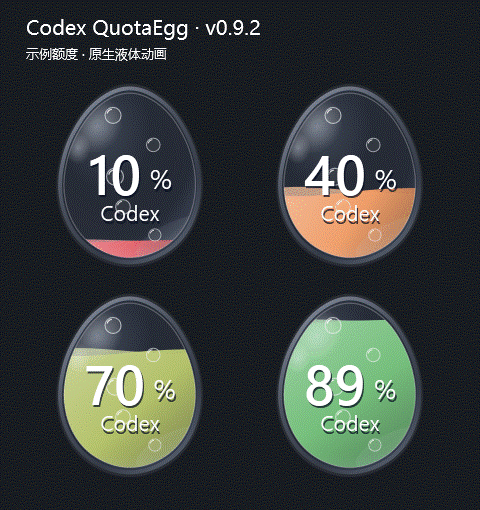
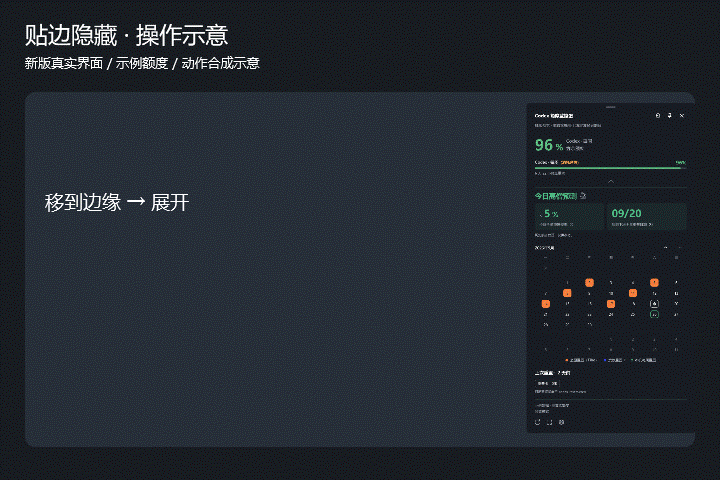
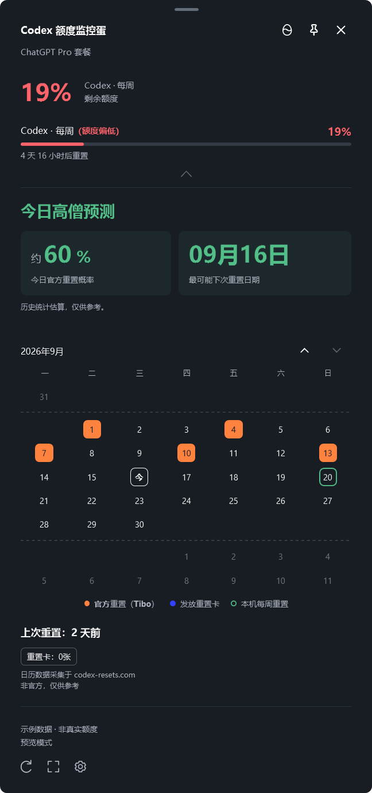
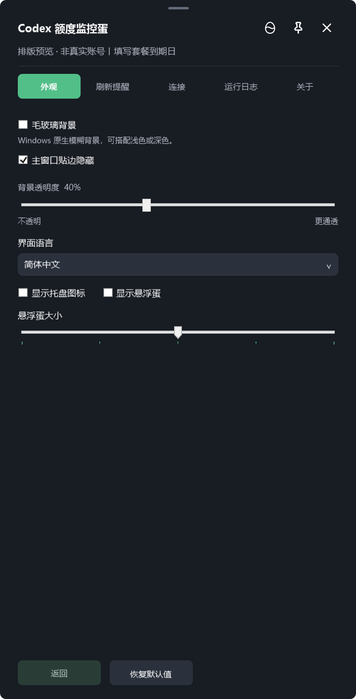
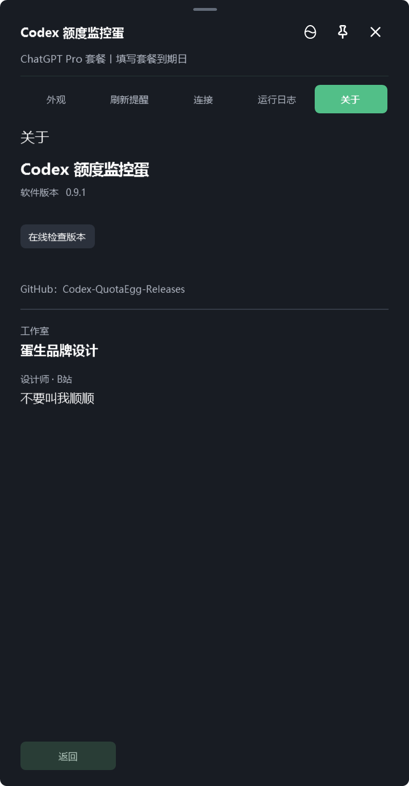

# Codex QuotaEgg · Codex 额度监控蛋

在 Windows 桌面查看 Codex 剩余额度：主窗口、彩色托盘与会晃动的液体悬浮蛋。

本仓库仅提供闭源软件的官方发行文件，不包含程序源代码。“官方发行”指本项目作者发布，不代表 OpenAI 官方产品。

## 下载 v0.9.5

Windows 10/11 x64 · 测试版 · 无需另装 .NET

- [安装版 MSI（推荐，可升级旧安装版）](https://github.com/BUYAOJIAOWOSHUNSHUN/Codex-QuotaEgg-Releases/releases/download/v0.9.5/Codex-QuotaEgg-0.9.5-setup.msi)
- [免安装版 ZIP（完整解压后运行）](https://github.com/BUYAOJIAOWOSHUNSHUN/Codex-QuotaEgg-Releases/releases/download/v0.9.5/Codex-QuotaEgg-0.9.5-portable.zip)
- [SHA-256 校验文件](https://github.com/BUYAOJIAOWOSHUNSHUN/Codex-QuotaEgg-Releases/releases/download/v0.9.5/SHA256SUMS.txt)
- [更新说明与历史安装包](https://github.com/BUYAOJIAOWOSHUNSHUN/Codex-QuotaEgg-Releases/releases)

GitHub 自动生成的 Source code 压缩包不是可运行程序。

## 液体额度蛋

额度百分比、液位和颜色同步变化；拖动时液体会晃动。下图由 v0.9.2 原生控件生成，10%、40%、70%、89% 均为示例额度，并非真实账号数据。

## v0.9.5 重置卡信息

- 点击重置卡可查看 Codex 返回的每张可用卡的到期日期、时间与本机时区；只有数量、没有日期时明确说明，不推测到期时间。
- 使用重置卡恢复的是个人额度，不计入全量重置历史预测；预测缺少可比历史样本时会解释横线原因。
- 已用掉的卡不再出现在当前可用明细中，无法从余额 0 反查原到期时间。

## v0.9.4 更新下载改进

- 支持断点续传：断线重试、主动停止或再次启动下载时，保留同一安装包的已有数据。服务器不支持续传时安全重新下载，最终仍须通过 SHA-256 校验。
- 主窗口显示“正在下载18%...”样式，省略号动态变化，移除旁边的小进度条；总大小未知时不虚构百分比。
- 悬停下载文字可查看速度、下载量与重试次数，并点击“停止下载”；停止后显示“继续下载”。校验和安装阶段不提供停止按钮。
- 持续低速时提供提示与手动更新入口，可停止软件内下载后转到浏览器。遵循设备网络设置，不内置私人代理或第三方镜像；不能保证所有网络都高速。

新下载逻辑自 v0.9.4 起生效；更旧版本升级时仍由其自身下载器处理。

### 最近的界面改进

- 木鱼改用录制音效，每次点击播放单敲，快速连点跟随点击节奏。
- 设置 → 外观新增声效开关和音量滑块，默认开启、音量 60%；调至 0% 或关闭开关即可无声，不改变系统音量。
- 修复中央折叠按钮收起时窗口和文字缩放跳动。

本次沿用 v0.9.2 的图片与动图，未重新制作；声效、音量控制及更新下载交互以当前程序为准。

## 已有功能

- 主窗口拖到左侧、右侧或顶部可吸附隐藏。鼠标离开后收起，移到细边展开；拖回屏幕内部解除吸附。设置 → 外观可关闭“主窗口贴边隐藏”。
- 收起、展开使用逐帧平滑移动；隐藏后的触发区限制在所属屏幕细边，修复其他屏幕点击误展开。
- 手动更新分为“正在下载”“正在安装”“更新完成”：下载显示已知大小的真实百分比，安装显示等待时间；网络无进度时提示等待响应并进行有界重试。
- 修正全量重置概率与预测日期旁两个说明图标的符号对齐。

上图使用新版真实界面合成动作示意，演示右侧收起与展开；不是桌面实录，也不代表实际运行帧率。

## 界面示例

以下为 v0.9.2 程序渲染的界面截图，额度与日历均使用示例数据。

### 主窗口

### 外观设置

### 关于与在线更新

## 使用说明

1. 先安装 Codex 并使用 ChatGPT 账号登录。
2. 安装 MSI，或完整解压 ZIP 后运行 `Codex QuotaEgg.exe`。
3. 主窗口查看额度，右上角切换额度蛋；主窗口和托盘使用一致的额度颜色。消耗速度提示另按时间进度判断，不等同于剩余额度颜色。
4. 启动与手动刷新会检查新版本；点击更新才下载和安装，没有后台自动下载安装开关。旧版升级到本版时，下载阶段仍由旧版界面显示，新进度界面用于本版今后的更新。

额度查询不发起模型对话，不消耗重置卡；日历来源为 codex-resets.com，全量重置预测仅供参考，不是确定日程。说明图标可查看计算口径。

本项目为非官方工具，与 OpenAI 无隶属、合作或背书关系。程序未进行代码签名，Windows 可能提示未知发布者。遇到下载停滞可稍后重试，或从本页手动下载安装包。

## 许可

Copyright (c) 2026 SHUNx2. All rights reserved.

本软件为闭源专有软件，可安装和使用作者正式发布的未修改版本；未经书面许可不得重新分发或修改。第三方组件依其原许可证，详见发行包与仓库中的许可文件。
